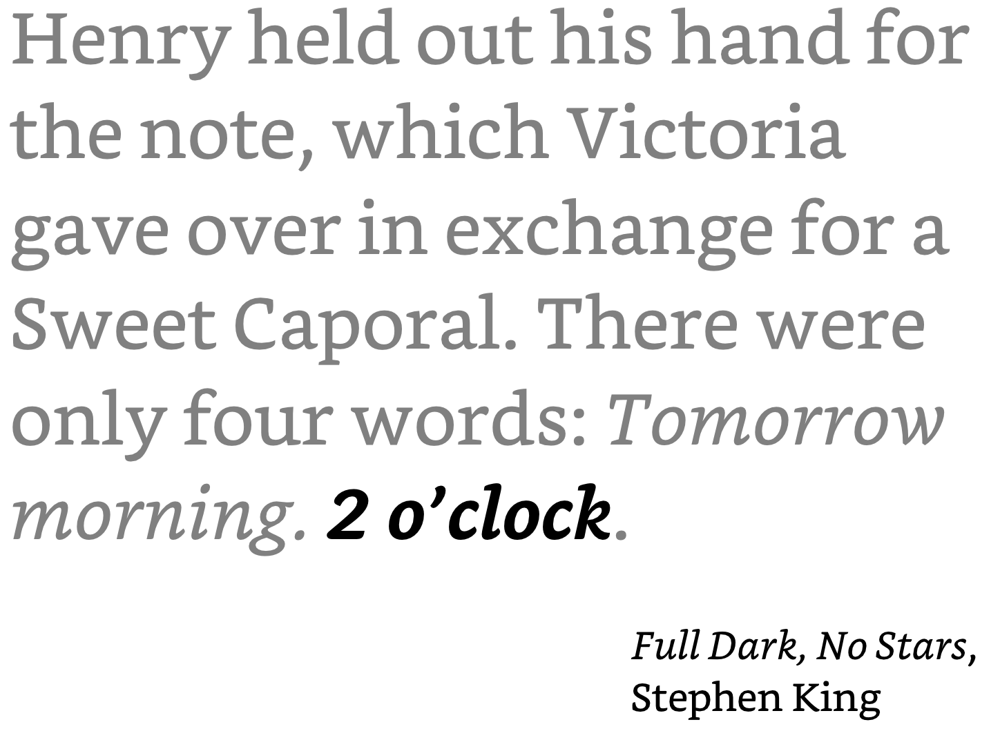
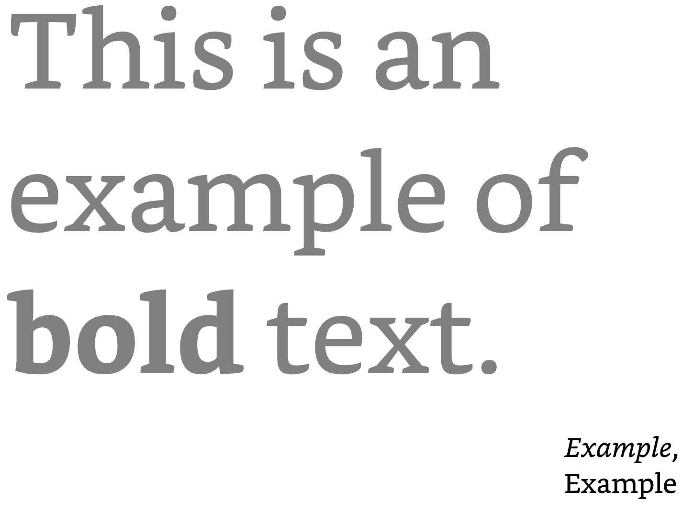
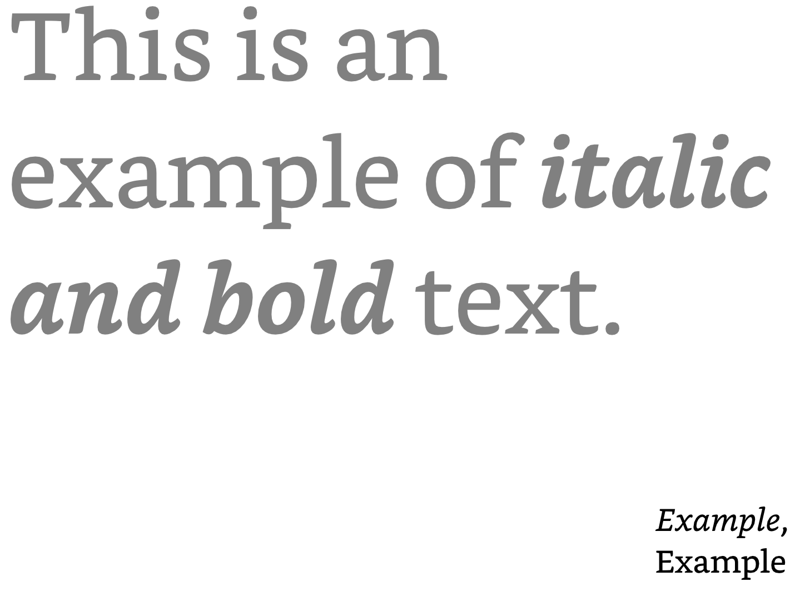
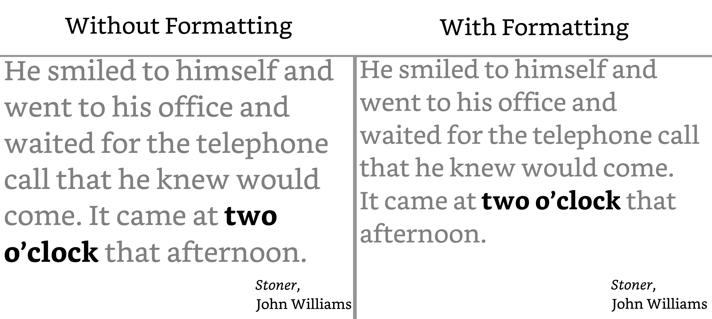
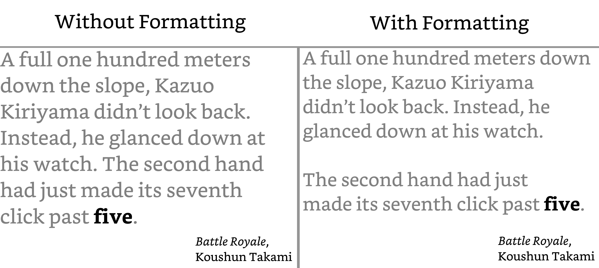
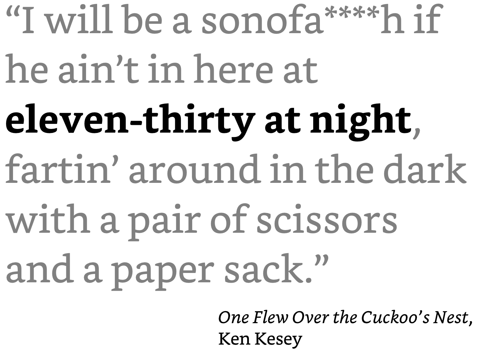
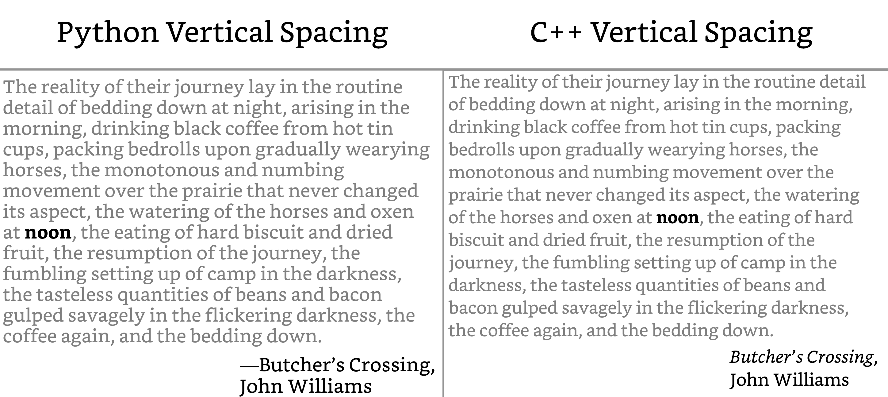

<h1 align="center">Literary Quote Clock Rewrite in C++</h1>

This is a C++ rewrite of my [Literary Quote Clock](https://github.com/alextaschuk/Literary-Quote-Clock), which was originally written in Python.

It currently works for Waveshare's [6-inch IT8951 EPD](https://www.waveshare.com/6inch-hd-e-paper-hat.htm). The program has all of the clock's original functionality and includes some improvements as well.

<p align="center">
    
</p>

## Table of Contents
<details>
<summary>Click to View</summary>

1. [How to Set up the Clock](#how-to-set-up-the-clock)
2. [Text Formatting](#text-formatting)
3. [Functionality Improvements](#functionality-improvements)
4. [Planned Features](#planned-features)

</details>

## How to Set up the Clock

### Materials

- [Waveshare 6-inch E-ink Display & HAT](https://www.waveshare.com/6inch-hd-e-paper-hat.htm)
- [Raspberry Pi](https://www.raspberrypi.com/products/)

### Setting up the Clock

1. Complete steps 1 and 2 on the [Working with Raspberry Pi (SPI)](https://www.waveshare.com/wiki/6inch_HD_e-Paper_HAT#Working_with_Raspberry_Pi_.28SPI.29) section on Waveshare's wiki page.

2. Clone this repository recursively onto the Pi (necessary to enable logger functions via spdlog) with:

    ```sh
    git clone --recursive https://github.com/alextaschuk/Lit-Clock-Cpp-Rewrite.git
    ```

    - *Note*: If you forgot the `--recursive` flag, run `git submodule update --init` to clone the logging library locally.

3. `cd` into the Repository and make a build folder:

    ```sh
    mkdir build && cd build && cmake .. && cd ..
    ```

4. In the [CPP_clock_build.service](scripts/CPP_clock_build.service) script, modify the `WorkingDirectory` variable to store the path to the build folder you just made.
    - The script is ran once during the Pi's startup to compile the program.

5. In the [CPP_clock.service](scripts/CPP_clock.service) script, modify the `ExecStart` variable to store the path to the `clock` binary in the build/ folder.
    - This script starts the clock after CPP_clock_build.service has run.

6. Move the scripts to /etc/systemd/system with:

    ```sh
    mv scripts/CPP_clock_build.service /etc/systemd/system/CPP_clock_build.service

    mv scripts/CPP_clock.service /etc/systemd/system/CPP_clock.service
    ```

7. Reload the systemd manager so that it sees the new service files:

    ```sh
    sudo systemctl daemon-reload
    ```

8. Enable the scripts and start the clock:

    ```sh
    sudo systemctl enable --now CPP_clock_build.service
    sudo systemctl enable --now CPP_clock.service
    ```

### Clock Configuration

There are a couple of global variables that can be configured for the clock. They exist in [constants.hpp](/include/constants.hpp). There are two notable variables:

- `VCOM`: This must match the VCOM value that's on the screen's FPC.
- `INCLUDE_CREDITS`: Set to `true` (default) if you want the book title and author of a quote to be displayed under it, or `false` to only show the quote.

## Text Formatting

In some instances, it may be worth preserving some or all of a quote's original formatting. One or more characters in a string of text can be wrapped with a delimiter to have the formatting be applied to the text.

### Italic `_` (U+005F, Low Line/Underscore)

Wrap text with this character to _italicize_ it. This may be combined with the bold delimiter to make the text ***italic and bold***.

For example, the CSV stores:

> Henry held out his hand for the note, which Victoria gave over in exchange for a Sweet Caporal. There were only four words: \_Tomorrow morning. 2 o’clock\_.

Which will be formatted as:

<p align="center">
    
</p>

### Bold `*` (U+002A, Asterisk)

Wrap text with this character to **bold** it. This may be combined with the bold delimiter to make the text ***italic and bold***.

There aren't any quotes yet where the bold delimiter has been needed, but I have added it as an option for future quotes. It is also used when an error message is printed to the screen.

Here's an example: 

> This is an example of \*bold\* text.

<p align="center">
    
</p>

### Italic and Bold

Text can be wrapped with both the italic and bold delimiters to make it ***italic and bold***.

There aren't any quotes yet where the bold delimiter has been needed, but I have added it as an option for future quotes.

Here's an example:

> This is an example of \_\*italic and bold\*\_ text.

<p align="center">
    
</p>


### Move Text to a New Line `\n` (U+000A, End of Line)

Any succeeding characters in a word after this character are put on a new line.

For example, the CSV stores:

> He smiled to himself and went to his office and waited for the telephone call that he knew would come. \nIt came at two o’clock that afternoon.

<p align="center">
    
</p>

This delimiter can be used in succession of itself to add white space between lines of text.

For example, the CSV stores:

> A full one hundred meters down the slope, Kazuo Kiriyama didn't look back. Instead, he glanced down at his watch. \n\nThe second hand had just made its seventh click past five.

<p align="center">
    
</p>

### Escape Character `\` (U+005C, Reverse Solidus/Backslash)

Add this character before a formatting delimiter to have the string literal version of the delimiter printed on the image.

For example, the CSV stores:

> “I will be a sonofa\\\*\\\*\\\*\\\*h if he ain’t in here at eleven-thirty at night, fartin’ around in the dark with a pair of scissors and a paper sack.”

Which will be formatted as:

<p align="center">
    
</p>


## Functionality Improvements and Changes

Writing this project in C++ gave me a lot more freedom in the way that quotes are converted to images.

### Improved Vertical Text Spacing

A drawback to the quote-to-image program I originally wrote in Python is that when creating a new `ImageFont.truetype` object from Pillow a `size` argument must be passed, which is the font's size, in pixels (i.e., the size of the font, already scaled to px units). I had to manually implement a lot of the the text writing functionality that Pillow provides via `ImageDraw.Draw.text`.

The most significant improvement is how lines of text are vertically spaced apart. Pillow doesn't expose a TT font's linegap, so the spacing between two lines of text in my Python program is calculated with `pen.coords['y'] += int(pen.font.getbbox("A")[3] + 4)`.

- For a more in-depth explanation about Pillow's reasoning for this workaround, read this [comment](https://github.com/python-pillow/Pillow/issues/6469#issuecomment-1203036583).

Since stb_truetype.h _does_ expose a TT font's linegap, it is much easier to calculate the font's intended vertical spacing between lines of text (scaled for px units):

```C++
int getLineHeight(const stbtt_fontinfo& font, const float& fontScale)
{
    int ascent, descent, lineGap;
    stbtt_GetFontVMetrics(&font, &ascent, &descent, &lineGap);
    return static_cast<int>((ascent - descent + lineGap) * fontScale);
}
```

This improves the readability of text, especially for quotes that are several lines long:

<p align="center">
    
</p>

## Planned Features

- [ ] parallelize writer.cpp
- [ ] Implement Knuth-Plass's line breaking algo for longer quotes (maybe).
    - https://web.archive.org/web/20180712183928/https://defoe.sourceforge.net/folio/knuth-plass.html
    - https://www.unicode.org/reports/tr14/
- [ ] fix writing calculations to convert floats to ints as late as possible
- [ ] clear screen on sigint
- [ ] check if it's possible to use 8bpp instead of 4bpp, and if there is even a difference
- [ ] optimize waveshare's code / reduce the amount of time it takes to display an image.
- [ ] redesign delimiter class and logic.