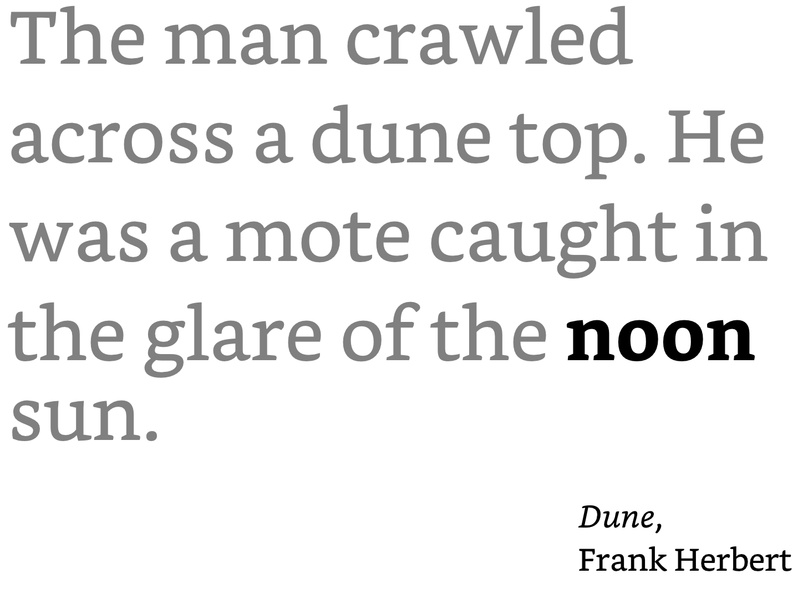
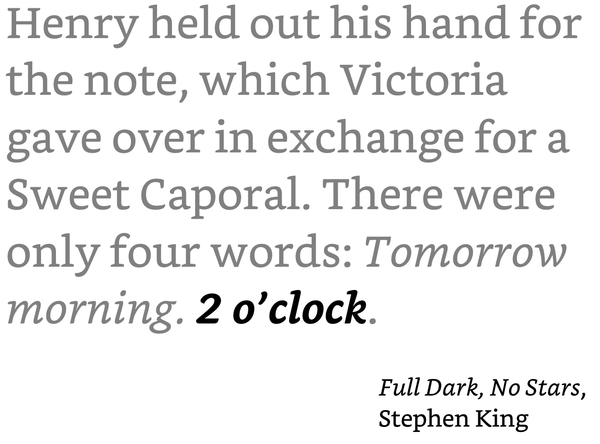
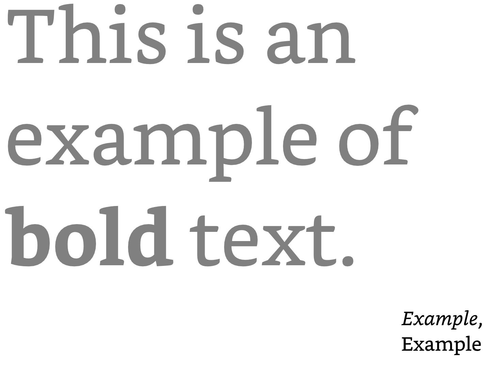
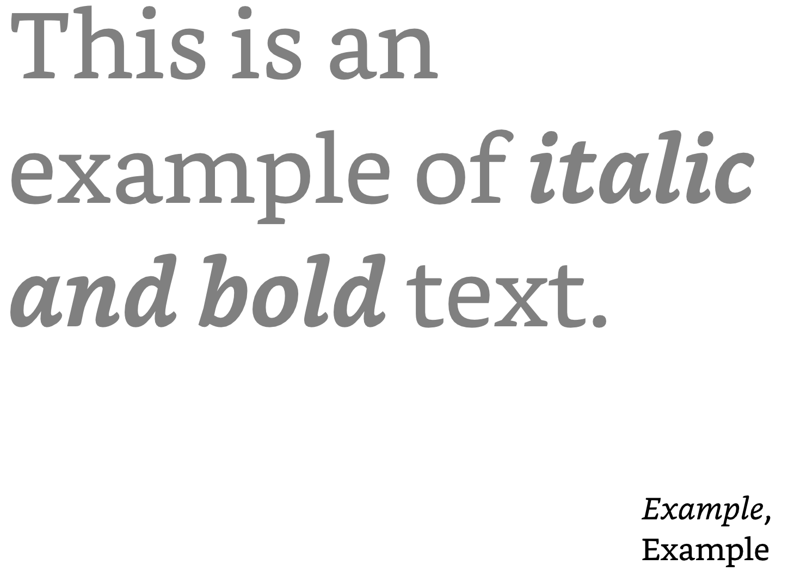
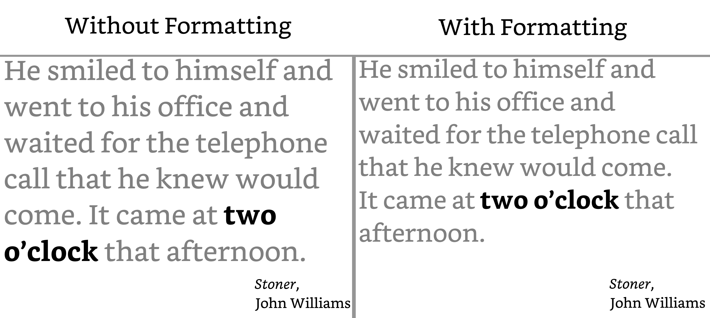
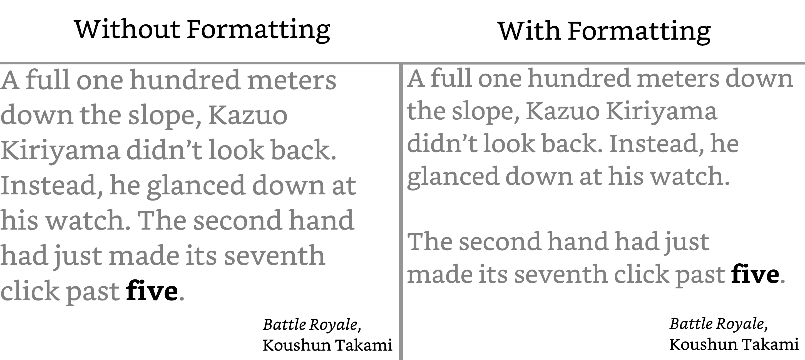
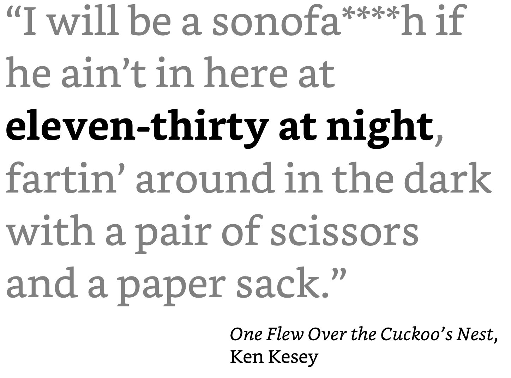
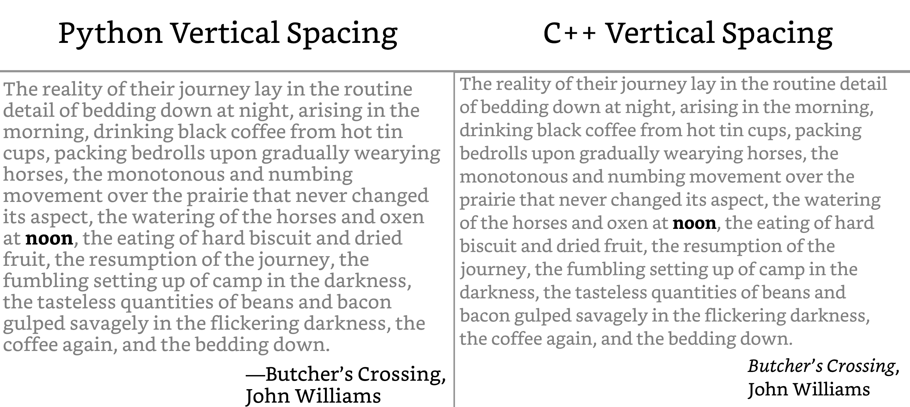

<h1 align="center">Literary Quote Clock Rewrite in C++</h1>

This is a C++ rewrite of my [Literary Quote Clock](https://github.com/alextaschuk/Literary-Quote-Clock), which was originally written in Python. The clock is compatible with Waveshare's [6-inch IT8951 EPD](https://www.waveshare.com/6inch-hd-e-paper-hat.htm) (though, it shouldn't be hard to modify it for other Waveshare EPDs). It has all of the Python clock's features and includes some improvements as well.
- The frame for this clock is a WIP.

<p align="center">
    
</p>

## Table of Contents
<details>
<summary>Click to View</summary>

1. [How to Set up the Clock](#how-to-set-up-the-clock)
    1. [Materials](#materials)
    2. [Setting up the Clock](#setting-up-the-clock)

2. [Text Formatting](#text-formatting)
    1. [_Italic Text_](#italic-_-u005f-low-lineunderscore)
    2. [**Bold Text**](#bold--u002a-asterisk)
    3. [***Italic and Bold Text***](#italic-and-bold)
    4. [Move Text to a New Line](#move-text-to-a-new-line-n-u000a-end-of-line)
    5. [Escape Character](#escape-character--u005c-reverse-solidusbackslash)

3. [Functionality Improvements and Changes](#functionality-improvements-and-changes)
    1. [Improved Vertical Text Spacing](#improved-vertical-text-spacing)

</details>

## How to Set up the Clock

### Materials

- [Waveshare 6-inch E-ink Display & HAT](https://www.waveshare.com/6inch-hd-e-paper-hat.htm)
- [Raspberry Pi](https://www.raspberrypi.com/products/)

### Setting up the Clock

1. Complete steps 1 and 2 on the [Working with Raspberry Pi (SPI)](https://www.waveshare.com/wiki/6inch_HD_e-Paper_HAT#Working_with_Raspberry_Pi_.28SPI.29) section on Waveshare's wiki page.

2. Clone this repository recursively onto the Pi (necessary to enable logger functions via spdlog) with:

    ```sh
    git clone --recursive https://github.com/alextaschuk/Lit-Clock-Cpp-Rewrite.git
    ```

    - *Note*: If you forgot the `--recursive` flag, run `git submodule update --init` to clone the logging library locally.

3. `cd` into the local repository, then run the clock's setup script:

    ```sh
    bash scripts/setup_clock.sh
    ```

- This script configures all of the necessary services to automatically run the clock when the Pi is turned on and have it automatically update. You will be prompted to enter two values:

    1. The VCOM value that is printed on your screen's FPC. Here is an example from Waveshare's wiki:

        

    2. Whether or not (y/n) you want the credits of each quote (i.e., the title of the book it is from and the book's author) to be displayed under the quote. By default, this is enabled. It slightly reduces the size of the quote's text, but not by a significant amount.

## Text Formatting

In some instances, it may be worth preserving some or all of a quote's original formatting. One or more characters in a string of text can be wrapped with a delimiter to have the formatting be applied to the text.

### Italic `_` (U+005F, Low Line/Underscore)

Wrap text with this character to _italicize_ it. This may be combined with the bold delimiter to make the text ***italic and bold***.

For example, a `quote` column in the CSV stores:

> Henry held out his hand for the note, which Victoria gave over in exchange for a Sweet Caporal. There were only four words: \_Tomorrow morning. 2 o’clock\_.

Which will be formatted as:

<p align="center">
    
</p>

### Bold `*` (U+002A, Asterisk)

Wrap text with this character to **bold** it. This may be combined with the bold delimiter to make the text ***italic and bold***.

There aren't any quotes yet where the bold delimiter has been needed, but I have added it as an option for future quotes. It is also used when an error message is printed to the screen.

Here's an example: 

> This is an example of \*bold\* text.

<p align="center">
    
</p>

### Italic and Bold

Text can be wrapped with both the italic and bold delimiters to make it ***italic and bold***.

There aren't any quotes yet where the bold delimiter has been needed, but I have added it as an option for future quotes.

Here's an example:

> This is an example of \_\*italic and bold\*\_ text.

<p align="center">
    
</p>


### Move Text to a New Line `\n` (U+000A, End of Line)

Any succeeding characters in a word after this character are put on a new line.

For example, a `quote` column in the CSV stores:

> He smiled to himself and went to his office and waited for the telephone call that he knew would come. \nIt came at two o’clock that afternoon.

<p align="center">
    
</p>

This delimiter can be used in succession of itself to add white space between lines of text.

For example, a `quote` column in the CSV stores:

> A full one hundred meters down the slope, Kazuo Kiriyama didn't look back. Instead, he glanced down at his watch. \n\nThe second hand had just made its seventh click past five.

<p align="center">
    
</p>

### Escape Character `\` (U+005C, Reverse Solidus/Backslash)

Add this character before a formatting delimiter to have the string literal version of the delimiter printed on the image.

For example, a `quote` column in the CSV stores:

> “I will be a sonofa\\\*\\\*\\\*\\\*h if he ain’t in here at eleven-thirty at night, fartin’ around in the dark with a pair of scissors and a paper sack.”

Which will be formatted as:

<p align="center">
    
</p>


## Functionality Improvements and Changes

Writing this project in C++ gave me a lot more freedom in the way that quotes are converted to images.

### Improved Vertical Text Spacing

A drawback to the quote-to-image program I originally wrote in Python is that when creating a new `ImageFont.truetype` object from Pillow a `size` argument must be passed, which is the font's size, in pixels (i.e., the size of the font, already scaled to px units). I had to manually implement a lot of the the text writing functionality that Pillow provides via `ImageDraw.Draw.text`.

The most significant improvement is how lines of text are vertically spaced apart. Pillow doesn't expose a TrueType font's linegap, so the spacing between two lines of text in my Python program is calculated with:

```Python
linegap = int(pen.font.getbbox("A")[3] + 4)
```

- For a more in-depth explanation about Pillow's reasoning for this workaround, read this [comment](https://github.com/python-pillow/Pillow/issues/6469#issuecomment-1203036583).

Since stb_truetype.h _does_ expose a TT font's linegap, it is much easier to calculate the font's intended vertical spacing between lines of text (scaled for px units):

```C++
int getLineHeight(const stbtt_fontinfo& font, const float& fontScale)
{
    int ascent, descent, lineGap;
    stbtt_GetFontVMetrics(&font, &ascent, &descent, &lineGap);
    return static_cast<int>((ascent - descent + lineGap) * fontScale);
}
```

This improves the readability of text, especially for quotes that are several lines long:

<p align="center">
    
</p>
